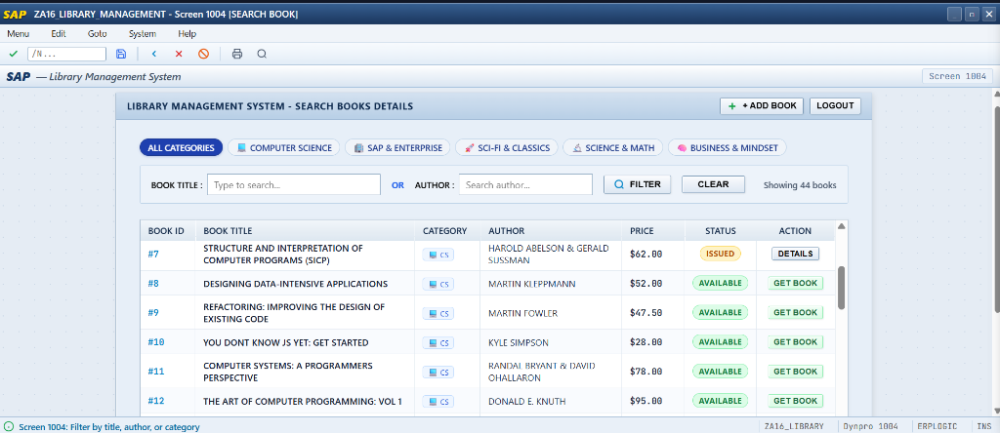
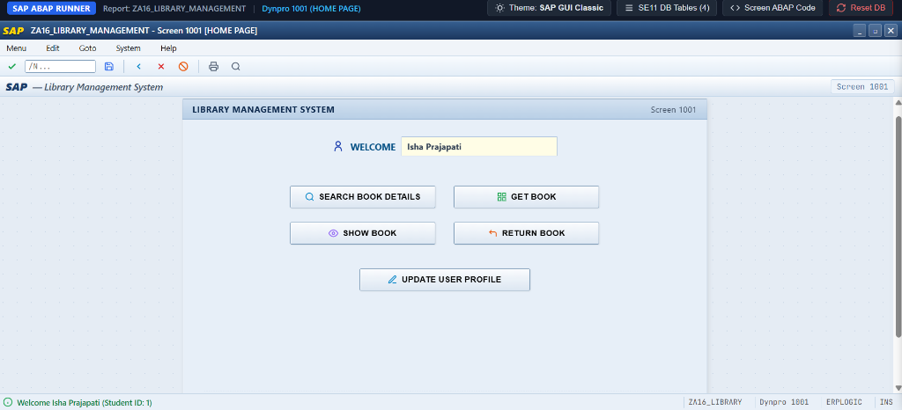
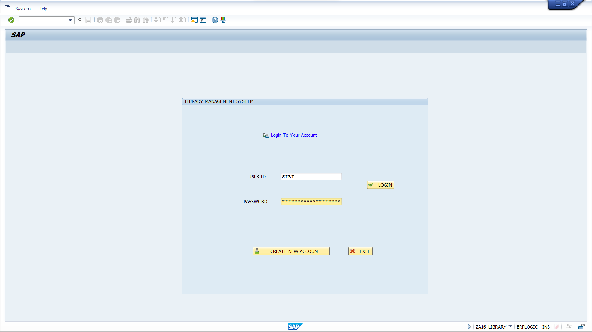
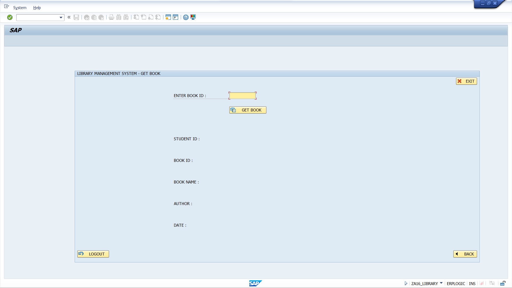
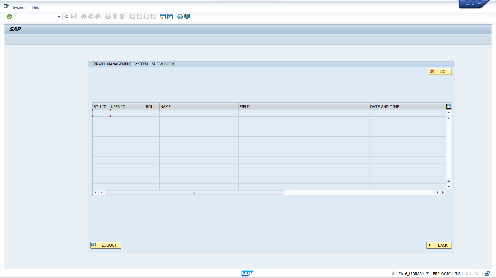

# 📚 SAP ABAP Library Management System (`ZA16_LIBRARY_MANAGEMENT`)

An enterprise-grade **SAP ABAP Module Pool / Dynpro Application** for comprehensive university and corporate library operations, complete with an interactive **SAP GUI Web Simulator & Live Runner**.


---

## 🌟 Application Previews & Screenshots

### 1. Interactive Book Search & Catalog (`Screen 1004`)
Filter across **44+ famous books** by Category (Computer Science, SAP & Enterprise, Sci-Fi, Science, Mindset), Title, or Author with real-time debounced search, availability tracking, and 1-click borrowing.



---

### 2. Main Navigation Dashboard / Home Page (`Screen 1001`)
Welcome dashboard showing personalized student info (`WELCOME Isha Prajapati`), direct module routing, profile updates, and active transaction management.



---

### 3. Authentication & Login (`Screen 1000`)
Authentic SAP GUI 7.xx Signature Theme user authentication with verification against DDIC table `ZA16_L_LOGIN`.



---

### 4. Issue Book (`Screen 1005`) & Active Borrowings Inner Join (`Screen 1007`)
<p align="center">
  
  
</p>

---

## 🏛️ System Architecture & SAP Components

This project implements standard SAP ABAP modular architecture across the ABAP Dictionary, Module Pool Programs, and Screen Painter:

```
┌─────────────────────────────────────────────────────────────────────────────┐
│                 SAP GUI / Web Simulator Frontend (Dynpro 1000-1008)         │
└──────────────────────────────────────┬──────────────────────────────────────┘
                                       │
                ┌──────────────────────┴──────────────────────┐
                │                                             │
                ▼                                             ▼
  ┌───────────────────────────┐                 ┌───────────────────────────┐
  │  PBO (Process Before O/P) │                 │  PAI (Process After I/P)  │
  │  STATUS_1000 to 1008      │                 │  USER_COMMAND_1000 - 1008 │
  └─────────────┬─────────────┘                 └─────────────┬─────────────┘
                │                                             │
                └──────────────────────┬──────────────────────┘
                                       │
                                       ▼
    ┌─────────────────────────────────────────────────────────────────────┐
    │              Report ZA16_LIBRARY_MANAGEMENT & Includes              │
    │  • ZA16_LOGIN_PAGE.ABAP         • ZA16_HOME_PAGE.ABAP               │
    │  • ZA16_REGISTRATION_PAGE.ABAP  • ZA16_SEARCH_BOOK.ABAP             │
    │  • ZA16_UPDATE_PROFILE.ABAP     • Table Controls (LIB1, EDWR)       │
    └──────────────────────────────────┬──────────────────────────────────┘
                                       │
                                       ▼
    ┌─────────────────────────────────────────────────────────────────────┐
    │                   ABAP Dictionary (SE11) Tables                     │
    │  • ZA16_L_LOGIN    (User Credentials & Student IDs)                 │
    │  • ZA16_L_INFO     (Student Profiles, Degrees & Branch Details)     │
    │  • ZA16_L_BOOK_INFO(Catalog of Books, Authors, & Pricing)           │
    │  • ZA16_L_GETBOOK  (Issued Books, Loan Dates & Return Tracking)     │
    └─────────────────────────────────────────────────────────────────────┘
```

---

## 📂 Repository Structure

```
├── ZA16_LIBRARY_MANAGEMENT.ABAP   # Main ABAP Module Pool / Report Program
├── INCLUDE PROGRAMS/              # Modularized Business Logic Includes
│   ├── ZA16_LOGIN_PAGE.ABAP       # Screen 1000 PBO/PAI & authentication logic
│   ├── ZA16_HOME_PAGE.ABAP        # Screen 1001 Navigation dispatcher
│   ├── ZA16_REGISTRATION_PAGE.ABAP# Screen 1002 & 1003 Two-step student onboarding
│   ├── ZA16_SEARCH_BOOK.ABAP      # Screen 1004 Catalog search & Table Control
│   └── ZA16_UPDATE_PROFILE.ABAP   # Screen 1008 Student profile modification
├── SCREEN/                        # Dynpro Screen Flow Logic & Layouts
│   ├── 1000 - LOGIN PAGE.ABAP     # PBO/PAI flow for Screen 1000
│   ├── 1001 - HOME PAGE.ABAP      # PBO/PAI flow for Screen 1001
│   ├── 1002 - REGISTRATION PAGE 1.ABAP
│   ├── 1003 - REGISTRATION PAGE 2.ABAP
│   ├── 1004 - SEARCH BOOK.ABAP    # Table Control 'LIB1' PBO loop
│   ├── 1005 - GET BOOK.ABAP       # Book issue module
│   ├── 1006 - RETURN BOOK.ABAP    # Return transaction
│   ├── 1007 SHOW BOOK.ABAP        # Table Control 'EDWR' Inner Join PBO loop
│   └── 1008 UPDATE PROFILE.ABAP   # Profile updater
├── TABLE/                         # SE11 Table Definitions & Metadata
│   ├── ZA16_L_LOGIN.png           # User ID, Password, Student ID schema
│   ├── ZA16_L_INFO.png            # Student details, Roll No, Field schema
│   ├── ZA16_L_BOOK_INFO.png       # Book ID, Name, Author, Price schema
│   └── ZA16_L_GETBOOK.png         # Issue ID, Student ID, Borrow dates schema
├── screenshots/                   # HD Previews & Application Screenshots
├── index.html                     # Pixel-perfect SAP GUI Live Simulator Web Runner
├── server.py                      # Local HTTP server with auto-browser launcher
└── run.bat                        # Windows 1-click execution script
```

---

## 🚀 How to Run Locally (Instant Web Simulator)

You can run the entire system locally without needing an enterprise SAP server:

### Option 1: Using Python Runner
```bash
python server.py
```
*The simulator will start on `http://localhost:8085` and automatically open your default browser.*

### Option 2: Windows Batch Launcher
Double-click `run.bat` in Windows Explorer.

### Option 3: Direct Browser Launch
Open `index.html` directly in any modern web browser.

#### Demo Credentials:
- **User ID:** `SIBI` | **Password:** `password123`
- Or click **CREATE NEW ACCOUNT** to register a new student account!

---

## 🛠️ Deploying to an SAP System (ECC / S4HANA)

If deploying to a real SAP NetWeaver AS ABAP server:

1. **Transaction SE11 (Data Dictionary):**
   - Create tables `ZA16_L_LOGIN`, `ZA16_L_INFO`, `ZA16_L_BOOK_INFO`, and `ZA16_L_GETBOOK` following the field definitions in [`TABLE/`](TABLE/).
2. **Transaction SE38 / SE80 (ABAP Workbench):**
   - Create executable program `ZA16_LIBRARY_MANAGEMENT`.
   - Create and activate the 5 include files in [`INCLUDE PROGRAMS/`](INCLUDE%20PROGRAMS/).
3. **Transaction SE51 (Screen Painter):**
   - Create Dynpro screens **1000 through 1008**.
   - Paste the screen flow logic from [`SCREEN/`](SCREEN/).
4. **Transaction SE93:**
   - Assign a custom transaction code (e.g. `ZLIB` or `ZA16_LIB`) pointing to program `ZA16_LIBRARY_MANAGEMENT` and starting screen `1000`.

---

## 👤 Author & Contact

- **Developer:** Isha Prajapati
- **Email:** ishaprajapati207@gmail.com
- **GitHub:** [@IshaPrajapati](https://github.com/IshaPrajapati)

---

## 📄 License
This project is open source and available under the [MIT License](LICENSE).